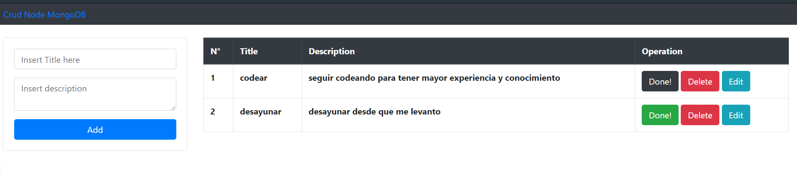

# CRUD con nodeJS y mongoDB
De manera muy sencilla es un crud basico,
su funcion es agregar tareas a realizar con un titulo y una descripcion.
Cuenta con tres botones, uno para cuando la tarea fue realizada y se resalta el boton en color verde,
otro para eliminar, cuando ya no deseamos mantener la tarea la podemos eliminar
editar para realizar cualquier modificacion a la tarea.

## frameworks
express
morgan
mongoose
se utiliza ejs como motor de plantilla

